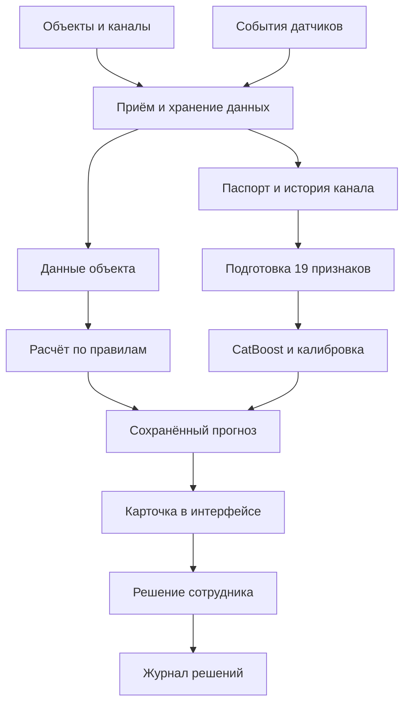

# Как устроено приложение

Приложение состоит из сервера, базы данных, расчётной части и интерфейса. На сервер поступают сведения об объектах, каналах и событиях. После расчёта прогноз сохраняется и становится доступен пользователю.

Есть два отдельных способа расчёта:

1. Прогноз по объекту с помощью правил или внешнего сервиса по ранее подготовленному API.
2. Прогноз новой тревоги по одному каналу с помощью обученной модели.

У этих способов разные входные данные и смысл результата. Для прогноза новой тревоги пока не выбран порог действия. Поэтому он не запускает автоматическую отправку уведомления.

### Компоненты

| Компонент | Для чего нужен |
| --- | --- |
| API и серверная логика | Вход, работа с данными, прогнозы, решения и комментарии. |
| Приём данных | Загрузка и обработка журналов, работа с источниками. |
| База данных | Хранение объектов, каналов, событий, прогнозов и решений. |
| Подготовка данных объекта | Сбор показаний и доступных сведений для прогноза по правилам. |
| Модуль прогноза по каналу | Подготовка признаков, вызов модели и сохранение результата. |
| Планировщик и обработчик задач | Фоновая обработка. Работа с Redis и восстановление после сбоев ещё требуют проверки. |
| Интерфейс | Карта, карточки, журналы, рекомендации и рабочие места сотрудников. |
| Шаблон внешнего сервиса модели | Проверка обмена данными. Его заглушка не является обученной моделью. |

Решение диспетчера сохраняется как обратная связь. Для оценки точности модели нужны также сведения о том, что действительно произошло после прогноза. Комментарий сотрудника сам по себе не подтверждает аварию.

[Все разделы](README.md)
