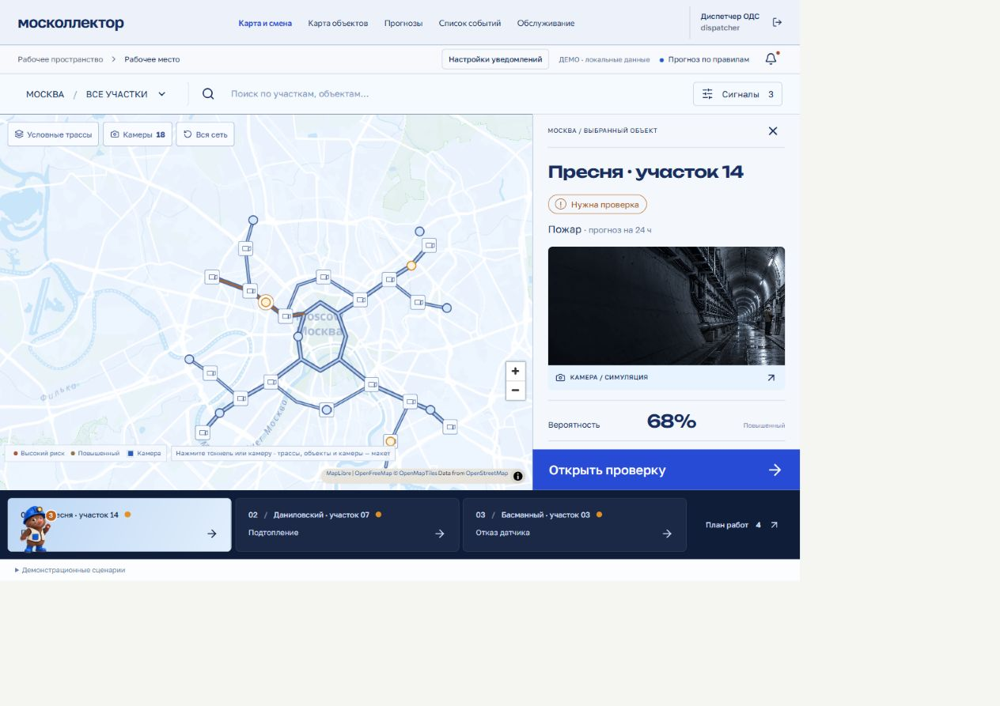
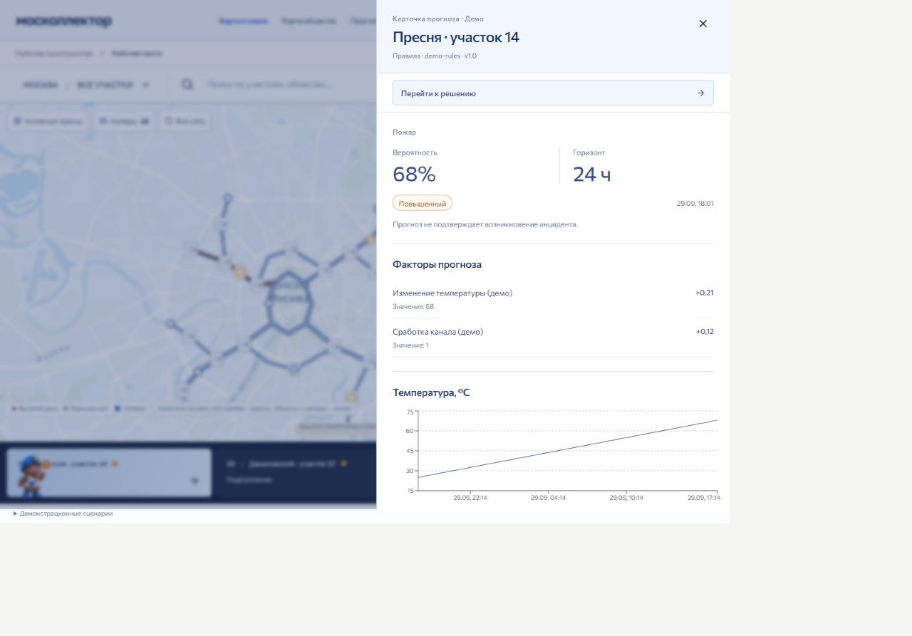
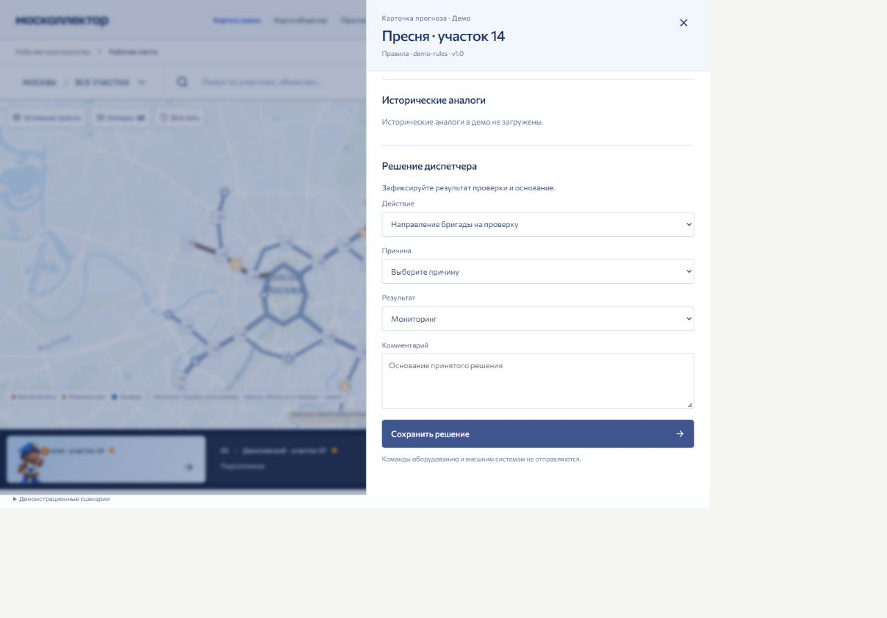
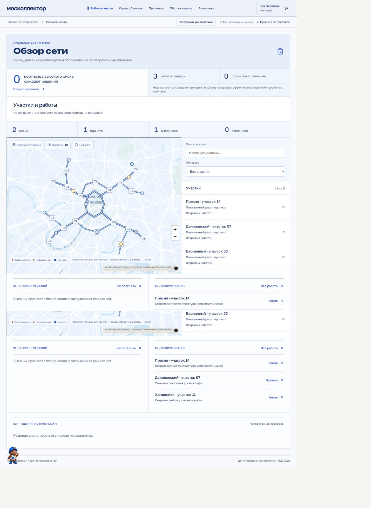

# Как показать проект

### Настоящий расчёт модели

1. Запустите сервер и интерфейс, загрузите данные через `python -m backend.seed`.
2. Откройте `/` и войдите как `dispatcher`.
3. Откройте «Демонстрационные сценарии».
4. Нажмите «ML: новая тревога · синтетика».
5. Приложение создаст искусственный паспорт газового канала `990001` и события за текущий и предыдущие часы.
6. Откройте карточку. В ней должны быть источник ML, горизонт 24 часа, вероятность, канал и время расчёта.
7. Сохраните решение с причиной и комментарием. Повторно откройте прогноз и проверьте запись.

Для этого прогноза ожидается статус «Порог не установлен». Данные искусственные, но расчёт выполняется настоящей моделью.

### Работа сотрудников

После расчёта можно показать карту, журнал событий и сохранённое решение. Затем открыть рабочее место техника с комментариями и обзор руководителя.

В прогнозах по правилам должна оставаться метка `rules`. Карта показывает условную сеть, камеры не передают видео. Telegram-доставка на сервере существует, но по умолчанию выключена; SMS и email остаются локальным черновиком.

## Скриншоты интерфейса

Снимки сделаны в локальном `/demo.html` с демонстрационными данными. На них показаны прогнозы по правилам. Расчёт обученной модели проверяется на основной странице по сценарию выше.

### Рабочее место диспетчера

### Карточка прогноза

### Решение диспетчера

### Обзор руководителя

[Все разделы](README.md)
